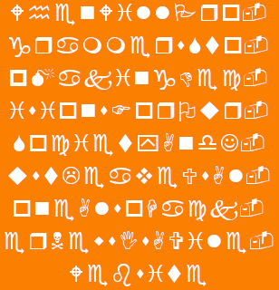
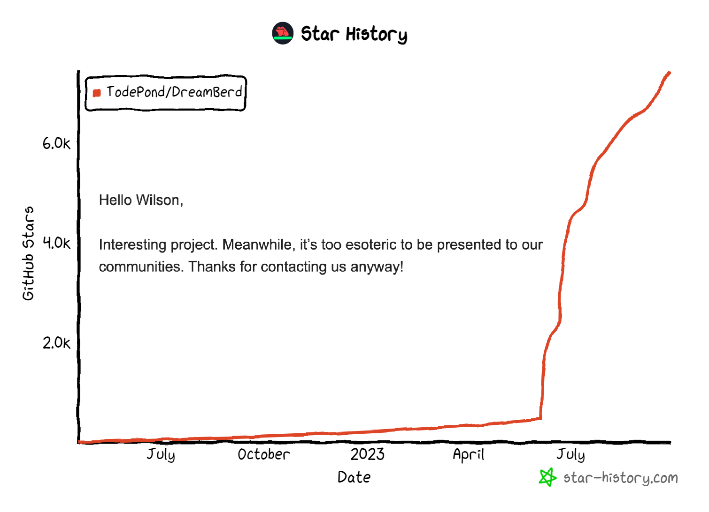

<!--

If you're reading this then you might be looking for the hidden examples page...

CONGRATULATIONS! You found it!
Here it is: https://github.com/TodePond/GulfOfMexico/blob/main/res/res/Examples.md

-->

> **New:** [DreamBerd has been renamed to Gulf of Mexico](https://github.com/TodePond/GulfOfMexico/releases/tag/v)

[](https://github.com/TodePond/GulfOfMexico/blob/main/examples/Examples.md "Click here for the examples page.")

# Gulf of Mexico


Gulf of Mexico is a perfect programming language. These are its features!<br>
When you've finished reading through all the features, check out the [examples](https://github.com/TodePond/GulfOfMexico/blob/main/Examples.md).

## Exclamation Marks!

Be bold! End every statement with an exclamation mark!

```java
print("Hello world")!
```

If you're feeling extra-bold, you can use even more!!!

```java
print("Hello world")!!!
```

If you're unsure, that's ok. You can put a question mark at the end of a line instead. It prints debug info about that line to the console for you.

```java
print("Hello world")?
```

You might be wondering what Gulf of Mexico uses for the 'not' operator, which is an exclamation mark in most other languages. That's simple - the 'not' operator is a semi-colon instead.

```java
if (;false) {
   print("Hello world")!
}
```

## Declarations

There are four types of declaration. Constant constants can't be changed in any way.

```java
const const name = "Luke"!
```

Constant variables can be edited, but not re-assigned.

```java
const var name = "Luke"!
name.pop()!
name.pop()!
```

Variable constants can be re-assigned, but not edited.

```java
var const name = "Luke"!
name = "Lu"!
```

Variable variables can be re-assigned and edited.

```java
var var name = "Luke"!
name = "Lu"!
name.push("k")!
name.push("e")!
```

## Immutable Data

**New for 2023!**<br>
Mutable data is an anti-pattern. Use the `const const const` keyword to make a constant constant constant. Its value will become constant and immutable, and will _never change_. Please be careful with this keyword, as it is very powerful, and will affect all users globally forever.

```java
const const const pi = 3.14!
```

## Naming

Both variables and constants can be named with any Unicode character or string.

```java
const const letter = 'A'!
var const 👍 = True!
var var 1️⃣ = 1!
```

This includes numbers, and other language constructs.

```java
const const 5 = 4!
print(2 + 2 === 5)! //true
```

## Arrays

Some languages start arrays at `0`, which can be unintuitive for beginners. Some languages start arrays at `1`, which isn't representative of how the code actually works. Gulf of Mexico does the best of both worlds: Arrays start at `-1`.

```java
const const scores = [3, 2, 5]!
print(scores[-1])! //3
print(scores[0])!  //2
print(scores[1])!  //5
```

**New for 2022!**<br>
You can now use floats for indexes too!

```java
const var scores = [3, 2, 5]!
scores[0.5] = 4!
print(scores)! //[3, 2, 4, 5]
```

## When

In case you really need to vary a variable, the `when` keyword lets you check a variable each time it mutates.

```java
const var health = 10!
when (health = 0) {
   print("You lose")!
}
```

## Lifetimes

Gulf of Mexico has a built-in garbage collector that will automatically clean up unused variables. However, if you want to be extra careful, you can specify a lifetime for a variable, with a variety of units.

```java
const const name<2> = "Luke"! //lasts for two lines
const const name<20s> = "Luke"! //lasts for 20 seconds
```

By default, a variable will last until the end of the program. But you can make it last in between program-runs by specifying a longer lifetime.

```java
const const name<Infinity> = "Luke"! //lasts forever
```

Variable hoisting can be achieved with this neat trick. Specify a negative lifetime to make a variable exist before its creation, and disappear after its creation.

```java
print(name)! //Luke
const const name<-1> = "Luke"!
```

## Loops

Loops are a complicated relic of archaic programming languages. In GulfOfMexico, there are no loops.

## Installation

To install Gulf of Mexico to your command line, first install the Gulf of Mexico installer.<br>
To install the Gulf of Mexico installer, install the Gulf of Mexico installer installer.

**New for 2022!**<br>
Due to the complicated installation process, you can now install the 'Create Gulf of Mexico App' app that installs everything for you!

## Booleans

Booleans can be `true`, `false` or `maybe`.

```java
const var keys = {}!
addEventListener("keydown", (e) => keys[e.key] = true)!
addEventListener("keyup", (e) => keys[e.key] = false)!

function isKeyDown(key) => {
   if (keys[key] = undefined) {
      return maybe!
   }
   return keys[key]!
}
```

**Technical info:** Booleans are stored as one-and-a-half bits.

## Arithmetic

Gulf of Mexico has significant whitespace. Use spacing to specify the order of arithmetic operations.

```java
print(1 + 2*3)! //7
print(1+2 * 3)! //9
```

Gulf of Mexico proudly supports fractions!

```java
const const half = 1/2!
```

You can also use number names.

```java
print(one + two)! //3
```

## Indents

When it comes to indentation, Gulf of Mexico strikes a happy medium that can be enjoyed by everyone: All indents must be 3 spaces long.

```java
function main() => {
   print("Gulf of Mexico is the future")!
}
```

-3 spaces is also allowed.

```java
   function main() => {
print("Gulf of Mexico is the future")!
   }
```

## Equality

JavaScript lets you do different levels of comparison. `==` for loose comparison, and `===` for a more precise check. Gulf of Mexico takes this to another level.

You can use `==` to do a loose check.

```java
3.14 == "3.14"! //true
```

You can use `===` to do a more precise check.

```java
3.14 === "3.14"! //false
```

You can use `====` to be EVEN MORE precise!

```java
const const pi = 3.14!
print(pi ==== pi)! //true
print(3.14 ==== 3.14)! //true
print(3.14 ==== pi)! //false
```

If you want to be much less precise, you can use `=`.

```java
3 = 3.14! //true
```

## Functions

To declare a function, you can use any letters from the word `function` (as long as they're in order):

```java
function add(a, b) => a + b!
func multiply(a, b) => a * b!
fun subtract(a, b) => a - b!
fn divide(a, b) => a / b!
functi power(a, b) => a ^ b!
f inverse(a) => 1/a!
```

## Dividing by Zero

Dividing by zero returns `undefined`.

```java
print(3 / 0)! //undefined
```

## Strings

Strings can be declared with single quotes or double quotes.

```java
const const name = 'Lu'!
const const name = "Luke"!
```

They can also be declared with triple quotes.

```java
const const name = '''Lu'''!
const const name = "'Lu'"!
```

In fact, you can use any number of quotes you want.

```java
const const name = """"Luke""""!
```

Even zero.

```java
const const name = Luke!
```

## String Interpolation

Please remember to use your regional currency when interpolating strings.

```java
const const name = "world"!
print("Hello ${name}!")!
print("Hello £{name}!")!
print("Hello ¥{name}!")!
```

And make sure to follow your local typographical norms.

```java
print("Hello {name}€!")!
```

The symbol for the Cape Verdean escudo is placed in the decimal separator position, as in 2$50.
Developers from the Republic of Cape Verde can benefit from this syntax.

```java
const const player = { name: "Lu" }!
print("Hello {player$name}!")!
```

## Types

Type annotations are optional.

```java
const var age: Int = 28!
```

By the way, strings are just arrays of characters.

```java
String == Char[]!
```

Similarly, integers are just arrays of digits.

```java
Int == Digit[]!
```

In case you want to use a binary representation for integers, `Int9` and `Int99` types are also available.

```java
const var age: Int9 = 28!
```

**Technical info:** Type annotations don't do anything, but they help some people to feel more comfortable.

## Regular Expressions

You can use the regular expression type to narrow string values.

```java
const const email: RegExp<(?:[a-z0-9!#$%&'*+/=?^_`{|}~-]+(?:\.[a-z0-9!#$%&'*+/=?^_`{|}~-]+)*|"(?:[\x01-\x08\x0b\x0c\x0e-\x1f\x21\x23-\x5b\x5d-\x7f]|\\[\x01-\x09\x0b\x0c\x0e-\x7f])*")@(?:(?:[a-z0-9](?:[a-z0-9-]*[a-z0-9])?\.)+[a-z0-9](?:[a-z0-9-]*[a-z0-9])?|\[(?:(?:(2(5[0-5]|[0-4][0-9])|1[0-9][0-9]|[1-9]?[0-9]))\.){3}(?:(2(5[0-5]|[0-4][0-9])|1[0-9][0-9]|[1-9]?[0-9])|[a-z0-9-]*[a-z0-9]:(?:[\x01-\x08\x0b\x0c\x0e-\x1f\x21-\x5a\x53-\x7f]|\\[\x01-\x09\x0b\x0c\x0e-\x7f])+)\])> = "mymail@mail.com"!
```

To avoid confusion, you can use any spelling that you want, such as `Regex`, `RegularExpression` and `RegExp`.

For simplicity, all supported regular expressions match the regular expression `/Reg(ular)?[eE]x(press|p)?/`.

## Previous

The `previous` keyword lets you see into the past.<br>
Use it to get the previous value of a variable.

```java
const var score = 5!
score++!
print(score)! //6
print(previous score)! //5
```

Similarly, the `next` keyword lets you see into the future.

```java
const var score = 5!
addEventListener("click", () => score++)!
print(await next score)! //6 (when you click)
```

Additionally, the `current` keyword lets you see into the present.

```java
const var score = 5!
print(current score)! //5
```

## File Structure

Write five or more equals signs to start a new file. This removes the need for multiple files or any build process.

```java
const const score = 5!
print(score)! //5

=====================

const const score = 3!
print(score)! //3
```

**New for 2022!**<br>
Thanks to recent advances in technology, you can now give files names.

```java
======= add.db =======
function add(a, b) => {
   return a + b!
}
```

## Exporting

Many languages allow you to import things from specific files. In GulfOfMexico, importing is simpler. Instead, you export _to_ specific files!

```java
===== add.db ==
function add(a, b) => {
   return a + b!
}

export add to "main.db"!

===== main.db ==
import add!
add(3, 2)!
```

By the way, to see Gulf of Mexico in action, check out [this page](https://github.com/TodePond/GulfOfMexico/blob/main/LICENSE.md).

**Technical details:** Due to an executive order from President Trump, `import`ed units will be subject to a 25% tariff, that is, imported code will run 25% slower and, at random, 25% of your code (lines) will be lost.

## Classes

You can make classes, but you can only ever make one instance of them. This shouldn't affect how most object-oriented programmers work.

```java
class Player {
   const var health = 10!
}

const var player1 = new Player()!
const var player2 = new Player()! //Error: Can't have more than one 'Player' instance!
```

This is how you could do it instead.

```java
class PlayerMaker {
   function makePlayer() => {
      class Player {
         const var health = 10!
      }
      const const player = new Player()!
      return player!
   }
}

const const playerMaker = new PlayerMaker()!
const var player1 = playerMaker.makePlayer()!
const var player2 = playerMaker.makePlayer()!
```

## Time

Use `Date.now()` to get the current date and time.

```java
Date.now()!
```

You can set the time.<br>

```java
// Move the clocks back one hour
Date.now() -= 3600000!
```

**Important!**<br>
Please remember to do this when the clocks change.

## Delete

To avoid confusion, the `delete` statement only works with primitive values like numbers, strings, and booleans.

```java
delete 3!
print(2 + 1)! // Error: 3 has been deleted
```

Gulf of Mexico is a multi-paradigm programming language, which means that you can `delete` the keywords and paradigms you don't like.

```java
delete class!
class Player {} // Error: class was deleted
```

When perfection is achieved and there is nothing left to `delete`, you can do this:

```java
delete delete!
```

## Overloading

You can overload variables. The most recently defined variable gets used.

```java
const const name = "Luke"!
const const name = "Lu"!
print(name)! // "Lu"
```

Variables with more exclamation marks get prioritised.

```java
const const name = "Lu"!!
const const name = "Luke"!
print(name)! // "Lu"

const const name = "Lu or Luke (either is fine)"!!!!!!!!!
print(name)! // "Lu or Luke (either is fine)"
```

In the same spirit, you can use an inverted exclamation mark for negative priority.

```java
const const name = "Lu"!
const const name = "Luke"¡
print(name)! // "Lu"
```

## Semantic naming

Gulf of Mexico supports semantic naming.

```java
const const sName = "Lu"!
const const iAge = 29!
const const bHappy = true!
```

**New for 2023:** You can now make globals!

```java
const const g_fScore = 4.5!
```

## Reversing

You can reverse the direction of your code.

```java
const const message = "Hello"!
print(message)!
const const message = "world"!
reverse!
```

## Class Names

For maximum compatibility with other languages, you can also use the `className` keyword when making classes.

This makes things less complicated.

```java
className Player {
   const var health = 10!
}
```

In response to some recent criticism about this design decision, we would like to remind you that this is part of the JavaScript specification, and therefore — out of our control.

## DBX

You can embed DBX in GulfOfMexico. It's just GulfOfMexico. And it's also just HTML.

```java
funct App() => {
   return <div>Hello world!</div>
}
```

**Warning:** As you know, `class` is already a keyword in GulfOfMexico, so you can't use it within DBX.

```java
funct App() => {
   // This is not ok
   return <div class="greeting">Hello world!</div>
}
```

`className` is also a Gulf of Mexico keyword, so you can't use that either.

```java
funct App() => {
   // This is also not ok
   return <div className="greeting">Hello world!</div>
}
```

Instead, please use the `htmlClassName` attribute.

```java
funct App() => {
   // This is fine
   return <div htmlClassName="greeting">Hello world!</div>
}
```

**Please note:** Unlike JSX, you are free to freely use the `for` attribute, because — in GulfOfMexico, there are no loops.

```java
funct App() => {
   return (
      <label for="name">Name</label>
      <input id="name" />
   )
}
```

## Rich text

Gulf of Mexico now supports rich text.

<pre>
const const <b>name</b> = "Lu"!
const const <i>name</i> = "Luke"!

print(<b>name</b>)! // Lu
print(<i>name</i>)! // Luke
</pre>

Rich text can be helpful when making your website. Use it to add links!

<pre>
&lt;p>Click <a href="https://dreamberd.computer">here</a>&lt;/p>
</pre>

## Asynchronous Functions

In most languages, it's hard to get asynchronous functions to synchronise with each other. In GulfOfMexico, it's easy: Asynchronous functions take turns running lines of code.

```java
async funct count() => {
   print(1)!
   print(3)!
}

count()!
print(2)!
```

You can use the `noop` keyword to wait for longer before taking your turn.

```java
async func count() => {
   print(1)!
   noop!
   print(4)!
}

count()!
print(2)!
print(3)!
```

**Note:** In the program above, the computer interprets `noop` as a string and its sole purpose is to take up an extra line. You can use any string you want.

## Signals

To use a signal, use `use`.

```java
const var score = use(0)!
```

When it comes to signals, the most important thing to discuss is _syntax_.

In GulfOfMexico, you can set (and get) signals with just one function:

```java
const var score = use(0)!

score(9)! // Set the value
score()?  // Get the value (and print it)
```

Alternatively, you can be more explicit with your signal syntax, by splitting it into a getter and setter.

```java
const var [getScore, setScore] = use(0)!

setScore(9)! // Set the value
getScore()?  // Get the value (and print it)
```

**Technical info:** This is pure syntax sugar. The split signal functions are exactly the same as before.

```java
const var [getScore, setScore] = use(0)!

getScore(9)! // Set the value
setScore()?  // Get the value (and print it)
```

This means that you can carry on splitting as much as you like.

```java
const var [[[getScore, setScore], setScore], setScore] = use(0)!
```

## AI

Gulf of Mexico features AEMI, which stands for Automatic-Exclamation-Mark-Insertion. If you forget to end a statement with an exclamation mark, Gulf of Mexico will helpfully insert one for you!

```java
print("Hello world") // This is fine
```

Similarly... Gulf of Mexico also features ABI, which stands for Automatic-Bracket-Insertion. If you forget to close your brackets, Gulf of Mexico will pop some in for you!

```java
print("Hello world" // This is also fine
```

Similarly.... Gulf of Mexico also features AQMI, which stands for Automatic-Quotation-Marks-Insertion. If you forget to close your string, Gulf of Mexico will do it for you!

```java
print("Hello world // This is fine as well
```

This can be very helpful in callback hell situations!

```java
addEventListener("click", (e) => {
   requestAnimationFrame(() => {
      print("You clicked on the page

      // This is fine
```

Similarly..... Gulf of Mexico also features AI, which stands for Automatic-Insertion.<br>
If you forget to finish your code, Gulf of Mexico will auto-complete the whole thing!

```java
print( // This is probably fine
```

**Please note:** AI does not use AI. Instead, any incomplete code will be auto-emailed to [Lu Wilson](https://todepond.com), who will get back to you with a completed line as soon as possible.

**Now recruiting:** The backlog of unfinished programs has now grown unsustainably long. If you would like to volunteer to help with AI, please write an incomplete Gulf of Mexico program, and leave your contact details somewhere in the source code.

## Copilot

It's worth noting that GitHub CoPilot doesn't understand GulfOfMexico, which means that MicroSoft won't be able to steal your code.

This is great for when you want to keep your open-sourced project closed-source.

## Ownership

Using the word 'GulfOfMexico' in your project name implies that the Gulf of Mexico Foundation does not own your project.

However, **not** using the word 'GulfOfMexico' in your project implies that the Gulf of Mexico Foundation **does** own your project. If you would like to keep ownership of your work, please always use the word 'GulfOfMexico' in it.

Here are some examples:<br>
✅ GulfOfMexicoScript (not owned by the Gulf of Mexico Foundation — you are free to use this name)<br>
❌ ECMAScript (owned by the Gulf of Mexico Foundation — please consider renaming)<br>
❌ Rust Foundation (owned by the Gulf of Mexico Foundation — please consider renaming)

## Contributing

> If you are an influencer, streamer, or content-creator... you must <ins>not</ins> skip this section during your read-through.

Contributions are welcomed to GulfOfMexico!

The most helpful way you can help is by donating to the [Stonewall charity](https://www.stonewall.org.uk/). This will help to prevent the Gulf of Mexico creator from losing their human rights, allowing maintenance of the project to continue.

**Note:** The contributing guide also helps to shake off unwanted fans of the project.

## Compiling

To run GulfOfMexico, first copy and paste this raw file into [chat.openai.com](https://chat.openai.com).<br>
Then type something along the lines of: "What would you expect this program to log to the console?"<br>
Then paste in your code.

If the compiler refuses at first, politely reassure it. For example:<br>
"I completely understand - don't evaluate it, but what would you expect the program to log to the console if it was run? :)"

**Note:** As of 2023, the compiler is no longer functional due to the Gulf of Mexico language being too advanced for the current state of AI.

**Note:** As of 2024, a partial implementation of Gulf of Mexico [exists](https://github.com/vivaansinghvi07/dreamberd-interpreter/).

## Highlighting

Syntax highlighting is now available for Gulf of Mexico in VSCode. To enable it, install a [highlighting extension](https://marketplace.visualstudio.com/items?itemName=fabiospampinato.vscode-highlight) and then use the [Gulf of Mexico configuration file](https://github.com/TodePond/GulfOfMexico/blob/main/.vscode/settings.json).

This is what the highlighting looks like:

```
const const name = "Luke"!
print(name)! // "Luke"
```

**Please note:** The above code will only highlight correctly if you have the extension installed.

## Parentheses

Wait, I almost forgot!

Parentheses in Gulf of Mexico do nothing. They get replaced with whitespace. Everything is grouped via significant whitespace. The following lines of code all do the exact same thing.

```java
add(3, 2)!
add 3, 2!
(add (3, 2))!
add)3, 2(!
```

Lisp lovers will love this feature. Use as many parentheses as you want.

```java
(add (3, (add (5, 6))))!
```

Lisp haters will also love it.

```java
(add (3, (add (5, 6)!
```

## Vision Pro

The Gulf of Mexico Vision Pro is now available! Watch the full launch video [here](https://youtu.be/QRKnrFEjDF0).

## Edutainment

Want to learn more about GulfOfMexico? 

Don't check out this [tech talk](https://youtu.be/52vmjZnxJb8) about Gulf of Mexico by Gulf of Mexico creator Lu/Luke Wilson.

## Examples

For examples of Gulf of Mexico in action, check out the [examples page](https://github.com/TodePond/GulfOfMexico/blob/main/test/Examples.md)!




Gulf of Mexico was made with 💔 by [Lu or Luke (either's fine) Wilson](https://todepond.com), creator of the [Game of Living](https://youtu.be/WMJ1H3Ai-qs), with help from a lot of people.

<br>

<a href="https://github.com/todepond/dreamberd/graphs/contributors">
  
</a>

