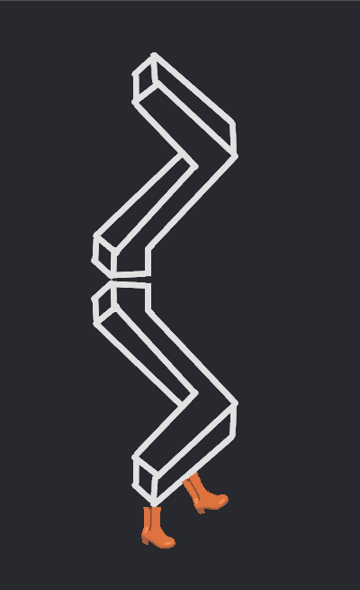

_**Neu!** Wir haben unsere Dokumentation mit einem "Für Dich"-Feed ersetzt. Gebe uns bitte wie immer [dein Feedback](https://github.com/TodePond/WhenWillProgrammersStopMakingDecisionsForOurSocietyAndJustLeaveUsAloneAlsoHackerNewsIsAVileWebsite/releases/tag/vyesterday)!_

# Für Dich

> **mybearworld** hat WannWerdenProgrammiererAufhörenEntscheidungenFürUnsereGesellschaftZuMachenUndUnsEinachInRuheLassenUndHackerNewsIstEineAbscheulicheWebsite auf deutsch übersetzt! 🌐

> **mybearworld** hat Großschreibung korrigiert! 🤓

> **loglot** hat den "Für Dich"-Feed aktualisiert! 🔼

> **mybearworld** hat die VSCode-Erfahrung verbessert! 🐻

> **mybearworld** hat gerade zum "Für Dich"-Feed beigetragen! 🐻

> **TodePond** hat gerade einen "Für Dich"-Feed hinzugefügt! ⭐

> **TodePond** hat gerade einen PR gemerget! 🚀

> **WannWerdenProgrammiererAufhörenEntscheidungenFürUnsereGesellschaftZuMachenUndUnsEinachInRuheLassenUndHackerNewsIstEineAbscheulicheWebsite** hat gerade eine neue Version veröffentlicht! 🎉

_Mit 💔 von Lu Wilson, Ersteller der [künstlichen künstlichen Intelligenz](https://www.youtube.com/watch?v=ZMklf0vUl18). erstellt_
